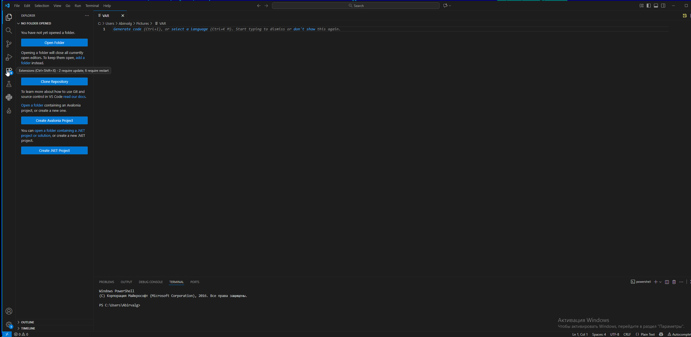
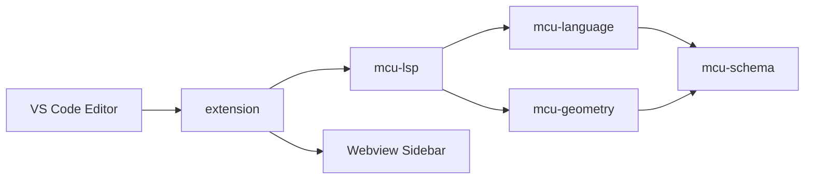

# MCU Helper

**Расширение для [Visual Studio Code](https://code.visualstudio.com/download) и Language Server** для исходных данных семейства [MCU6](#о-mcu-и-mcu-nr).

[`VS Code ^1.85`](https://code.visualstudio.com/download) · `Node.js` · язык `mcunr` · ~660 тестов

> **English:** MCU Helper is a VS Code extension and Language Server for editing MCU6 input decks — text files that describe materials, 3D geometry, sources, tallying, and burnup for Monte Carlo particle transport. It brings syntax highlighting, diagnostics, completions, hover documentation, sum-isotope highlighting (`SI` / `SINOT` / `SIDEN`), MDBNR library checks (AW.LIB / PARAMETE.THR T½ vs IAEA), a module catalog, run actions for MCU-NR, and convenient navigation inside MCU input files.



---

## Содержание

- [О MCU](#о-mcu-и-mcu-nr)
- [Что такое McuHelper](#что-такое-mcuhelper)
- [Возможности](#возможности)
- [Установка](#установка)
- [Быстрый старт](#быстрый-старт)
- [Сверка библиотек MDBNR](#сверка-библиотек-mdbnr)
- [Команды](#команды)
- [Настройки](#настройки)
- [Разработка](#разработка)
- [Тесты и документация](#тесты-и-документация)
- [Поддержка автора](#поддержка-автора)

---
## Коллеги! 
### Нас мало, но мы в тельняшках
Прошу все замечания, уточнения, баг-репорты и пожелания отправлять в [**issues**](https://github.com/int21h-dz/MCUHelper/issues)

## О MCU и MCU-NR

### Программа MCU

[**MCU**](https://mcuproject.ru/rabout.html) (**M**onte-**C**arlo **U**niversal) — проект Курчатовского института по разработке универсальной программы для численного моделирования переноса излучения в трёхмерных системах методом Монте-Карло. Поддерживаются нейтроны, гамма-кванты, электроны и позитроны.

Метод Монте-Карло позволяет моделировать взаимодействие излучения с веществом на основе оценённых ядерных данных без жёстких ограничений на геометрию. Программы семейства MCU применяются при анализе ядерной и радиационной безопасности, расчётах реакторов, проектировании защиты, дозиметрии, моделировании выгорания и во многих других задачах атомной отрасли.

Подробнее на официальном сайте: **[О проекте MCU](https://mcuproject.ru/rabout.html)**.

---

## Что такое McuHelper

Исходники MCU — большие текстовые файлы со строгим синтаксисом.

**McuHelper** добавляет в VS Code удобную работу с ними: подсветку, диагностику, подсказки, навигацию и запуск MCU-NR из редактора.

### Архитектура

Монорепозиторий из пакетов и расширения VS Code:

| Компонент | Назначение |
|-----------|------------|
| [`packages/mcu-schema`](packages/mcu-schema) | Схемы карт PIN/GEO, типы тел, hover-тексты, каталог шаблонов модулей |
| [`packages/mcu-language`](packages/mcu-language) | Лексер, парсер, семантический анализ, индекс документа |
| [`packages/mcu-geometry`](packages/mcu-geometry) | Geometry IR, аналитика зон, запросы к геометрии |
| [`packages/mcu-lsp`](packages/mcu-lsp) | Language Server: diagnostics, completion, hover, custom requests |
| [`extension/`](extension) | UI VS Code: боковая панель и команды |



---

## Возможности

### Редактор и Language Server

- **Подсветка синтаксиса**
- **Диагностики** в реальном времени:
  - запрет табуляции в коде (в `**` / `C=` и после `;` допустима);
  - порядок фрагментов варианта;
  - карта в «чужом» фрагменте (`card-wrong-fragment`);
  - ссылки на несуществующие тела и зоны;
  - состав `MATR`: нуклиды, концентрации, `MODS`, дубликаты и лишние параметры;
  - наличие нуклидов в `AW.LIB` и `DEFAULT.PHY` (MDBNR); нуклиды в `SI`/`SINOT` не требуют записи в банках;
  - сверка `AW.LIB` (атомные массы) и `PARAMETE.THR` (**только T½**; разделы DECAY/CAPTURE/YIELD в THR не разбираются) с **IAEA LiveChart** — предупреждения `aw-mass-mismatch`, `thr-halflife-mismatch` (один раз на изотоп);
  - группы `ENERGY` / `ENERG` (монотонность, нижние границы ≥ 0);
  - физические величины ≥ 0 (температура, плотность, мощность, время, объёмы);
  - неинициализированные имена в `EQU`/`SET` и выражениях;
  - отсутствующий `#include` и ошибки солвера из `NAME.LST` после запуска
- **Автодополнение** — все карты (~229 меток), алиасы, аргументы карт (`SUMZON`→`SUMB`…`ZONG`, `CONTEN`→`DENS`…, `CODE`→`RSTP`…), символы документа
- **Signature Help** — подсказка активного параметра при вводе тел (`RCC`, `RCZ`, …), карт (`MATR`, `POWER`, `STEP`, `SI`/`SINOT`/`SIDEN`, …), строк нуклидов
- **Всплывающие подсказки** — описания из UserGuide; для нуклидов — концентрация, плотность, атомная масса, объёмная активность (Бк/см³) по T½ из PARAMETE.THR; данные **IAEA NDS** (природные смеси — bundled fallback без сети для частых элементов + кнопка разложения); для `POWER`/`STEP`, `EMES`/`EPRO`, `VOL` — дополнительные расчёты и мини-отчёты
- **Суммарный изотоп** (UserGuide §8.5) — карты `SI` / `SINOT` / `SIDEN`: нуклиды входящие в суммарный изотоп подсвечиваются серым в редакторе и приглушённо в панели «Материалы»; в hover — причина пометки (список SI/SINOT или порог `SIDEN`)
- **Автоопределение языка** `mcunr` по содержимому (`PIN`, `MATR`, `HEAD`, …)
- **Автоопределение кодировки** — UTF-8 / Windows-1251 / CP866 / KOI8-R для legacy-файлов и `#include`
- **Сворачивание (folding)** — фрагменты варианта, блоки `MATR`, `LCELL…ENDL` и `LATT`
- **`#include` — inline через CodeLens** — над строкой `#include`: **▸ Развернуть** (вставляет редактируемый блок с подсветкой `mcunr` прямо в вариант), **▾ Свернуть** (сохраняет в include-файл в исходной кодировке), **↗ Открыть** (файл с языком `mcunr`); если файла нет — создаётся пустой при развёртке/открытии; при **Save** развёрнутые блоки авто-сворачиваются; Ctrl+Click / F12 по пути; fallback `#include confpd` → `.mcu`/`.mcunr`
- **Диагностика `#include`** — семантика единого варианта (expanded); ошибки внутри include — группа `#include` / URI файла; вложенный `#include` запрещён
- **Выделение маркеров разделов** — `PIN`, `HEAD`, `FINISH` и др. визуально крупнее (bold + цвет + фон)

### Боковая панель MCU-NR

Иконка в Activity Bar открывает контейнер **MCU-NR**:

| Вкладка | Назначение |
|---------|------------|
| **Запуск** | Кнопки Debug / Run / Continue / Final; пути — шестерёнка в заголовке (`Ctrl+Alt+P`); «♥» — поддержка автора |
| **Каталог** | 8 модулей варианта; карточки карт с hover; drag или клик → вставка шаблона |
| **Диагностика** | Ошибки и предупреждения текущего файла; группы **`#include`** (переход в include-файл) и **«Сверка изотопов»** (AW/THR vs IAEA, экспорт CSV); открывается после MCU-run при ошибках LST |
| **Навигация** | Фрагменты варианта, карты/операторы и `#include` (без тел, зон, EQU/SET, CONT); клик по include — к строке директивы в варианте |
| **Материалы** | Дерево `MATR` с плотностью и группами; нуклиды суммарного изотопа — приглушённо |
| **Константы** | Эффективный набор `EQU`/`SET` в позиции курсора (global + локальные LCELL/CELL) |
| **Тела** | Список геометрических тел по scope |
| **Сети** | Ячейки `NET` |
| **Решётки** | Элементы `LATT` / `LCELL` |
| **Зоны** | Булевы выражения зон |
| **Объекты** | Регистрационные объекты |

Клик по элементу — переход к строке в файле. Кнопка обновления на панели — пересчёт индекса. Status bar **MCU-NR** открывает вкладку «Запуск».

### Запуск MCU-NR

Перед первым запуском: **MCU-NR: Настроить пути запуска** (`Ctrl+Alt+P`) — указать `exe` MCU-NR и папку библиотеки констант (MDBNR). Текущие пути видны в tooltip панели «Запуск».

| Кнопка / команда | Хоткей (по умолчанию) | Режим | Что делает |
|------------------|----------------------|-------|------------|
| **Debug** | `Ctrl+Alt+D` | INPUT (`i`) | Проверка входных данных; открывает `NAME.LST` из temp-run; переход к первой ошибке |
| **Run** | `Ctrl+Alt+R` | CALCULATION (`a`) | Полный расчёт; копирует и открывает `NAME.FIN` рядом с вариантом; если FIN нет — открывает LST из temp-run |
| **Continue** | `Ctrl+Alt+Shift+C` | continue (`c`) | Продолжение расчёта без очистки промежуточных файлов |
| **Final** | `Ctrl+Alt+F` | OUTPUT (`f`) | Финальная выдача; копирует и открывает `NAME.FIN`; если FIN нет — LST из temp-run |

Кнопка **DEFAULT.PHY** на панели «Запуск» (или команда **MCU-NR: DEFAULT.PHY (банк данных)**) открывает таблицу файла из корня MDBNR. Штатно значения по умолчанию для нуклида в расчёте переопределяют картой `DEF` в исходных данных; правка банка влияет на все варианты.

При ошибках из LST автоматически открывается вкладка **Диагностика**.

#### Как изменить хоткеи

**Самый простой способ** (расширение должно быть установлено и включено):

1. `Ctrl+Shift+P` → **MCU-NR: Настроить горячие клавиши запуска**  
   (или иконка клавиатуры в заголовке вкладки **Запуск**).
2. Откроется редактор Shortcuts уже с фильтром `mcuhelper.` — видны Debug / Run / Continue / Final / пути.
3. Карандаш у строки → новое сочетание → `Enter`.

Если открывали Shortcuts вручную и **ничего не находится**:

- ищите не `MCU-NR`, а **`mcuhelper.`** (это id команд: `mcuhelper.debugInput`, …);
- либо `Debug (INPUT)`, `Run (CALCULATION)`;
- убедитесь, что смотрите окно, где расширение реально работает (после F5 — это **Extension Development Host**, не основное окно Cursor без установленного VSIX);
- сбросьте фильтр «User» / «Source», если включён — нужны все команды, не только ваши переопределения.

| Команда в Shortcuts (id) | Заголовок | По умолчанию |
|--------------------------|-----------|--------------|
| `mcuhelper.debugInput` | MCU-NR: Debug (INPUT) | `Ctrl+Alt+D` |
| `mcuhelper.runCalculation` | MCU-NR: Run (CALCULATION) | `Ctrl+Alt+R` |
| `mcuhelper.continueCalculation` | MCU-NR: Continue (CALCULATION) | `Ctrl+Alt+Shift+C` |
| `mcuhelper.finalOutput` | MCU-NR: Final (OUTPUT) | `Ctrl+Alt+F` |
| `mcuhelper.configureSolver` | MCU-NR: Настроить пути запуска | `Ctrl+Alt+P` |

> Debug / Run / Continue / Final срабатывают при активном редакторе с языком `mcunr`. Настройка путей — без этого ограничения.

Рабочий каталог: `.mcuhelper-runs/<имя_варианта>/` рядом с файлом (имя варианта — из имени открытого файла). Туда копируются вариант и все файлы `#include`. MCU запускается в интегрированном терминале; после завершения разбирается `NAME.LST` и выставляются диагностики.

### Прочее

- **MCU-NR: Разложить природный элемент на изотопы** — кнопка в hover нуклида (ICE)
- **MCU-NR: Добавить в суммарный изотоп** — кнопка в hover и «В SI» в панелях Диагностика/Материалы для нуклидов с `aw-mass-missing` / `phy-missing` (и `-siden`); ищет карту SI/`SINOT` в том числе внутри `#include`; не превышает 200 символов code-части строки (при необходимости — continuation)
- **MCU-NR: Определить язык по содержимому** — ручное переключение на `mcunr`
- **MCU-NR: Определить кодировку** — повторная проверка кодировки файла
- Встроенные настройки **cSpell** для языка `mcunr` (игнорирование имён карт и тел)
  
---

## Сверка библиотек MDBNR

При заданном `mcuhelper.mcuConstantsLibPath` LSP читает `AW.LIB` и `BURN6/PARAMETE.THR` из корня MDBNR и сверяет с локальным кэшем **IAEA LiveChart** (бандл в VSIX + user-кэш `~/.mcuhelper/`; сеть — только при отсутствии данных).

| Источник | Что сверяется | Диагностика в редакторе | Отчёт |
|----------|---------------|-------------------------|-------|
| `AW.LIB` | атомные массы | `aw-mass-mismatch`, `aw-mass-missing` | Output «MCU-NR Helper» |
| `PARAMETE.THR` | **только T½** (LONGLIFE/SHORTLIFE) | `thr-halflife-mismatch` | Output «MCU-NR Helper» |
| `DEFAULT.PHY` | наличие записи для нуклида MATR | `phy-missing` | — |

Полный отчёт по AW/THR: **MCU-NR: Отчёт сверки библиотек (Output)** или автоматически после старта LSP. Разделы DECAY/CAPTURE/YIELD/BRANCHING в `PARAMETE.THR` расширением **не разбираются** — только периоды полураспада для hover и сверки.

---

## Установка

Для работы расширения нужен **[Visual Studio Code](https://code.visualstudio.com/download)** (версия 1.85 и новее). Скачать: [code.visualstudio.com/download](https://code.visualstudio.com/download).

### Из VSIX (рекомендуется для пользователей)

1. Скачать свежий релиз [MCUHelper](https://github.com/int21h-dz/MCUHelper/releases)

2. Установите в VS Code:
   - **Extensions** → **…** → **Install from VSIX…**
   - или из командной строки:

     ```bat
     code --install-extension release\mcuhelper-vscode-0.10.0.vsix
     ```

### Из исходников (разработка)

```bash
npm install
npm run build
```

Запуск: откройте репозиторий в VS Code → **F5** → **Extension Development Host**.

*После установки расширения в панели слева должна появиться пиктограмма языка пламени, если это не так, следует проверить есть ли у расширения разрешения на работу. Для этого в **Extensions** надо найти установленное расширение **MCU-NR Helper**, кликнуть по нему и убедиться, что расширение запущено.*
---

## Быстрый старт

1. Откройте файл варианта — `.mcu`, `.mcunr` или текстовый файл с картами `PIN` / `MATR` / `HEAD`.
2. Язык редактора переключится на **mcunr** автоматически (настройка `mcuhelper.autoDetectLanguage`).
3. В Activity Bar нажмите иконку **MCU-NR** — откроется боковая панель с каталогом и навигацией.
4. Наведите курсор на карту или нуклид — появится hover с описанием и данными (для нуклидов суммарного изотопа — ещё и причина пометки).
5. Для запуска расчёта: вкладка **Запуск** → **Настроить пути** → **Debug** / **Run**.

**Примеры файлов** в репозитории:

| Файл | Что демонстрирует |
|------|-------------------|
| [test/fixtures/full_variant.mcu](test/fixtures/full_variant.mcu) | Полный вариант |
| [test/fixtures/pin_example.mcu](test/fixtures/pin_example.mcu) | Фрагмент PIN / MATR |
| [test/fixtures/trx_geometry.mcu](test/fixtures/trx_geometry.mcu) | Пример описания геометрии |
| [test/fixtures/latt_example.mcu](test/fixtures/latt_example.mcu) | Решётка LATT |
| [test/fixtures/cell_example.mcu](test/fixtures/cell_example.mcu) | Ячейка CELL / NET |

---

## Команды

Вызов: **Ctrl+Shift+P** → введите `MCU-NR`.

### Запуск MCU-NR

| Команда | Описание |
|---------|----------|
| MCU-NR: Debug (INPUT) | Проверка входа; открывает LST из temp-run; переход к первой ошибке |
| MCU-NR: Run (CALCULATION) | Полный расчёт; копирует/открывает FIN, иначе LST из temp-run |
| MCU-NR: Continue (CALCULATION) | Продолжение расчёта |
| MCU-NR: Final (OUTPUT) | Финальная выдача; копирует/открывает FIN, иначе LST из temp-run |
| MCU-NR: Настроить пути запуска | Выбор exe и папки MDBNR (`Ctrl+Alt+P`) |
| MCU-NR: DEFAULT.PHY (банк данных) | Таблица DEFAULT.PHY из корня MDBNR; штатно для расчёта — карта `DEF` |
| MCU-NR: Настроить горячие клавиши запуска | Открыть Shortcuts с фильтром `mcuhelper.` |
| MCU-NR: Действия запуска | Quick-pick всех действий запуска |

### Навигация и каталог

| Команда | Описание |
|---------|----------|
| MCU-NR: Каталог модулей | Открыть вкладку каталога |
| MCU-NR: Диагностика | Открыть вкладку диагностики |
| MCU-NR: Навигация | Вкладка навигации по фрагментам |
| MCU-NR: Показать материалы | Вкладка материалов |
| MCU-NR: Показать константы | Вкладка констант |
| MCU-NR: Показать тела | Вкладка тел |
| MCU-NR: Показать сети | Вкладка сетей |
| MCU-NR: Показать решётки | Вкладка решёток |
| MCU-NR: Показать зоны | Вкладка зон |
| MCU-NR: Показать объекты | Вкладка объектов |
| MCU-NR: Обновить индекс | Пересчитать индекс документа |
| MCU-NR: Вставить шаблон | Вставка шаблона из каталога |

### Дополнительные команды

| Команда | Описание |
|---------|----------|
| MCU-NR: Экспорт диагностик | Вывод Problems в Output |
| MCU-NR: Отчёт сверки библиотек (Output) | Полный отчёт AW.LIB / PARAMETE.THR (T½) vs IAEA в канал «MCU-NR Helper» |
| MCU-NR: Следующая диагностика | Переход к следующей LSP-диагностике (`Alt+F8`) |
| MCU-NR: Предыдущая диагностика | Переход к предыдущей LSP-диагностике (`Alt+Shift+F8`) |
| MCU-NR: Следующая ошибка лексера | Переход к следующей ошибке лексера (`Alt+F7`) |
| MCU-NR: Предыдущая ошибка лексера | Переход к предыдущей ошибке лексера (`Alt+Shift+F7`) |

### Утилиты

| Команда | Описание |
|---------|----------|
| MCU-NR: Определить язык по содержимому | Принудительно `mcunr` |
| MCU-NR: Определить кодировку | Повторная проверка кодировки файла |
| MCU-NR: Разложить природный элемент на изотопы | ICE-разложение из hover |
| MCU-NR: Добавить в суммарный изотоп | Дописать нуклид в карту SI (из hover / sidebar) |
| MCU-NR: Развернуть #include inline | CodeLens: вставить редактируемый блок include в вариант |
| MCU-NR: Свернуть #include | CodeLens: сохранить inline-блок обратно в include-файл |
| MCU-NR: Открыть файл #include | CodeLens: открыть include с языком `mcunr` |

---

## Настройки

**Settings** → поиск `mcuhelper`. Пути запуска удобнее задавать через **MCU-NR: Настроить пути запуска** (`Ctrl+Alt+P`).

| Параметр | По умолчанию | Описание |
|----------|--------------|----------|
| `mcuhelper.mcuNrPath` | *(пусто)* | Путь к исполняемому файлу MCU-NR |
| `mcuhelper.mcuConstantsLibPath` | *(пусто)* | Корень MDBNR (библиотека констант; в `mcu5.ini` — со слэшем в конце) |
| `mcuhelper.autoDetectLanguage` | `true` | Определять MCU-NR по содержимому и переключать язык на `mcunr` |
| `mcuhelper.autoDetectFromLanguages` | `plaintext`, `txt`, `ini`, … | С каких language id переключать (уже размеченные языки не трогает) |
| `mcuhelper.autoDetectEncoding` | `true` | Определять кодировку legacy-файлов и при необходимости переоткрывать документ |
| `mcuhelper.trace.server` | `off` | Лог LSP: `off` / `messages` / `verbose` |

Имя варианта для запуска берётся из **имени открытого файла** (без расширения), а не из отдельной настройки.

---

## Разработка

### Сборка

```bash
npm install
npm run build
```

Скрипт `build` компилирует все пакеты и копирует бандл LSP в `extension/server/server.js` (нужно для VSIX и Extension Development Host).

### Упаковка VSIX

```bat
package-vsix.bat
```

---

## Тесты и документация

### Тесты

```bash
npm test
```

Запускает ~660 тестов в пакетах `mcu-schema`, `mcu-language`, `mcu-geometry`, `mcu-lsp`, `extension`.

```bash
npm run test:coverage
npm run coverage:check
```

Покрытие (c8): lines/statements ≥ 95%, branches ≥ 80%, functions ≥ 88%.

### Документация

| Ресурс | Описание |
|--------|----------|
| [structure.md](structure.md) | Структура репозитория, LSP, экспериментальные сценарии |
| [mcuproject.ru](https://mcuproject.ru/rabout.html) | Официальный сайт семейства программ MCU |

---

## Связанные ссылки

- [Visual Studio Code — скачать](https://code.visualstudio.com/download) — редактор, в котором работает расширение
- [О проекте MCU](https://mcuproject.ru/rabout.html) — Monte-Carlo Universal, Курчатовский институт

---

## Поддержка автора

Если расширение оказалось полезным, можно поддержать разработку через CloudTips:

[Поблагодарить автора](https://pay.cloudtips.ru/p/84f5f8d5)

<p align="center">
  <a href="https://pay.cloudtips.ru/p/84f5f8d5">
    
  </a>
</p>

<p align="center"><sub>Отсканируйте QR-код или откройте ссылку выше</sub></p>
